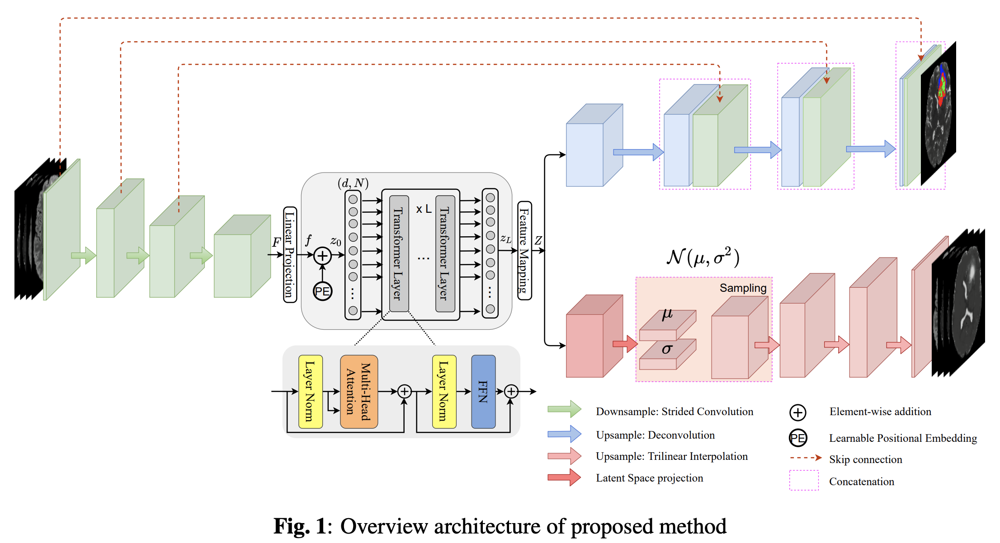
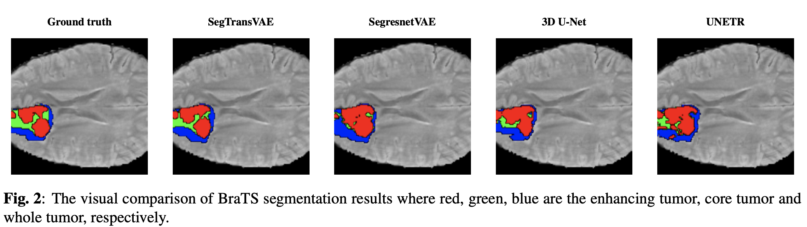

# SegTransVAE
This repo is the official implementation for SegTransVAE. 

## SegTransVAE 
Here is the network architecture of SegTransVAE, a hybrid CNN-Transformer-VAE for medical image segmentation  


## Requirements
- python 3.8
- pytorch 1.8.0
- monai 0.6
- pytorch lightning
- nibabel
- itk 


## Data 
After downloading BraTS 2021 dataset, create a json file, which contains the path to images and the correspoding labels as follow

Then, use data/brats.py file to read the data by monai. 

## Training
Run the training script on BraTS dataset. Change the model hyperparameters setup in trainer.py. When everything is finish, go to **lightning_train.py** to config multi-gpu training or half-precision training. 

``` 
python lightning_train.py --exp EXP 
```
EXP is the name of the experiment and it will save all the checkpoint and the logs based on that experiment name. 

## Testing 
After finish training, you can test your model by replace the path to the checkpoints in **lightning_test.py**
```
python lightning_test.py
```
Then the evaluation metric will print in the terminal, including dice score and 95% hausdorff distance. 


## Quantitative result
Quantitive comparison of performance on BraTS 2021 (our test set)


Quantitive comparison of performance on KiTS19 with 5-fold cross validation. 


## Visual Comparision with SOTA Methods 
Visual Comparision of our method on BraTS 2021 and KiTS19 dataset with 3D U-Net, SegresnetVAE and UNETR. 



## Complexity 


